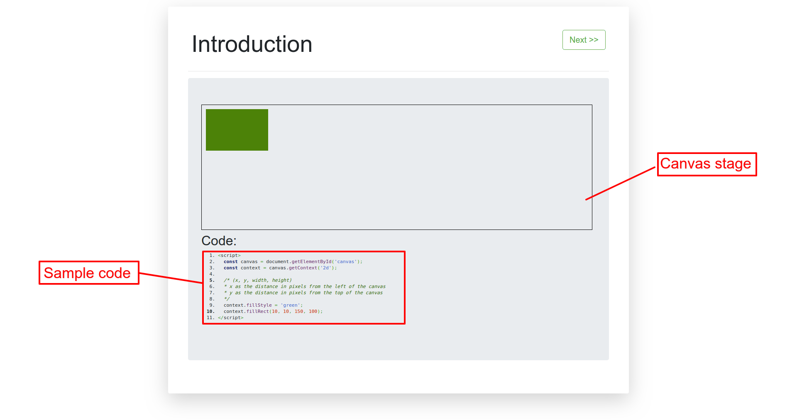

## About

### Brief
In this repo I gather and apply my knowledge on the JavaScript [Canva API](https://developer.mozilla.org/en-US/docs/Web/API/Canvas_API). This interest was gaining while working on a client project and I was immediately drawn to it. Feel free to clone and check it out.

### Setup

Simply:
- Clone the repo 

```
git clone https://github.com/PeterKitonga/canvasapiplayground.git
```
- Navigate to the project and click on the `index.html` file

### Illustration


### Tutorial
Visit [MDN web docs](https://developer.mozilla.org/en-US/docs/Web/API/Canvas_API) for the tutorial